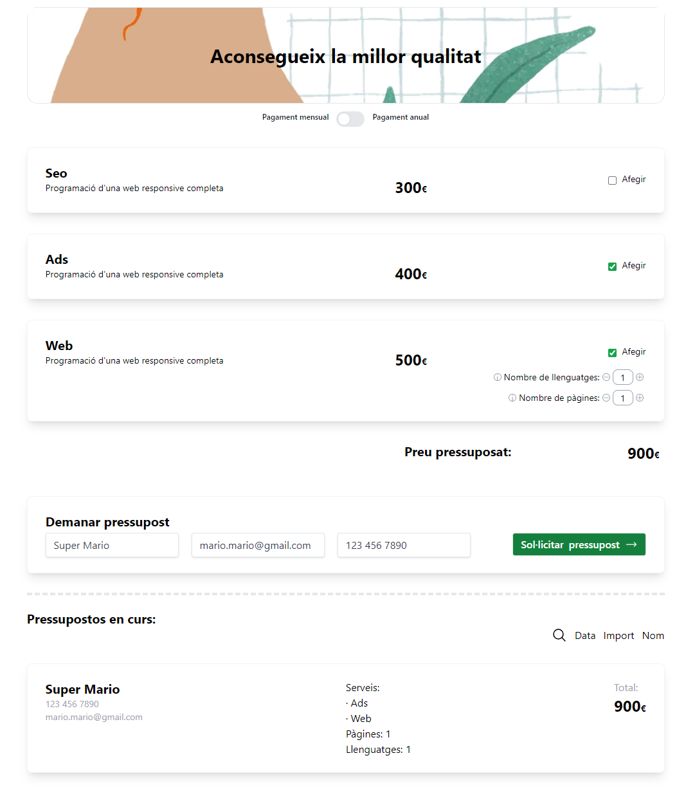

# Sprint 6 - Presupostos

This is the sixth sprint in the itacademy React.js course. The task was to follow the instructions and build a website for the management of budgets.



To explore the source code, start with App.jsx .
**Note**: This project was initialized with Vite.

## How to run

After having cloned the repository, run the following commands at the root:

```sh
Npm install
Npm run dev
```

## Functionality overview

The example application is a budget logging site called "Presupostly".

**General functionality**:

- Selection of products, including page and language count for web pages
- Calculation of order price
- Input of client contact data
- Toggling between monthly and yearly prices
- Listing of logged budgets by price, name and original order
- Responsive URL

**The general page breakdown looks like this**:

- Landing page (URL: /#/ )
- Link to Homepage
- Homepage (URL: /#/calculator)
- Customization of current budget
- Introduction of Contact information
- Listing of created budgets
